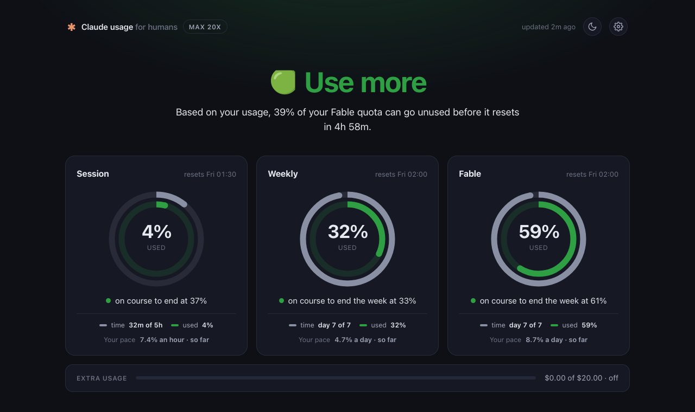

# cuh · Claude usage for humans

**Get the most out of your Claude subscription, <ins>*based on how you actually use it*</ins>.**



I never understood how to make sense of the usage percentages Claude shows, so
I built cuh. It reads your pace and tells you what the numbers mean, right in
Claude Code's status line:

- **Never hit the wall mid-task.** See a limit coming hours before it lands, and
  slow down while there is still time to finish.
- **Never leave frontier quota unused.** Know when you are on course to end the
  week with a third of the top model untouched, and reach for it instead.

```sh
$ cuh --remote http://<server>:8787 --secret <secret>
🟢 USE MORE Fable · 38% may go unused  │  S 3% W 29% Fable 52%
```

## How it works

- **Each Claude Code** runs `cuh` as its status line. When the server's
  numbers are over 5 minutes old, that run fetches your usage from Anthropic
  with the local login and posts it to the server.
- **The server** keeps every sample in one `history.jsonl`, works out your pace
  from it, and serves a clear picture of where you stand to every status line.

## Server

Docker, on any always-on box:

```sh
CUH_SECRET=<something long and random> make up    # docker compose up -d --build
make logs                                         # one "sample ..." line per post
make down
```

Add `CUH_PORT=8788` before `make up` to publish on another port. The values
stick: the container keeps them across restarts and reboots.

Without Docker:

```sh
make build
./cuh serve --listen :8787 --data-dir ./data --secret <secret>
```

The server also hosts a dashboard at `http://<server>:8787/`: the same picture,
laid out for a browser, with each limit's pace and where it lands at the reset.
It asks for the secret once.

## Each computer with Claude Code

Install the client, then put the hook in `~/.claude/settings.json`:

```sh
make install                    # ~/.local/bin/cuh
```

```json
{ "statusLine": { "type": "command", "command": "cuh --remote http://<server>:8787 --secret <secret>" } }
```

Do this on **every** computer you use Claude Code from. Sampling only happens
where Claude Code is open, so a machine without the hook leaves gaps in the
history. Usage is account-level, so all machines report the same numbers and
totals are never lost, only detail.

Add `--json` for the data behind the line.

## When something is off

The status line says so. `⚠ server offline · last update 2h ago` means the
server is down and you see cached numbers. `⚠ last update 40m ago` means the
server is up but nothing has posted for a while. `⚠ sampling failed` means this
machine could not fetch; `--json` shows the reason.

## Development

```sh
make test       # pace math, verdicts, client sampling and backoff, server storage
make release    # binaries for linux, macOS, windows into dist/
```
